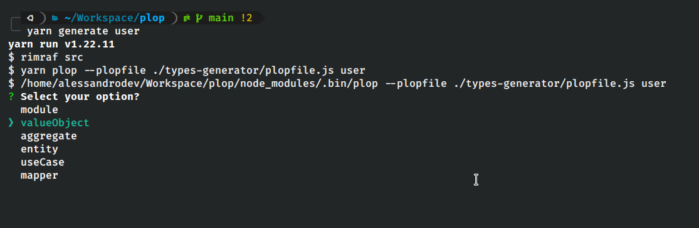
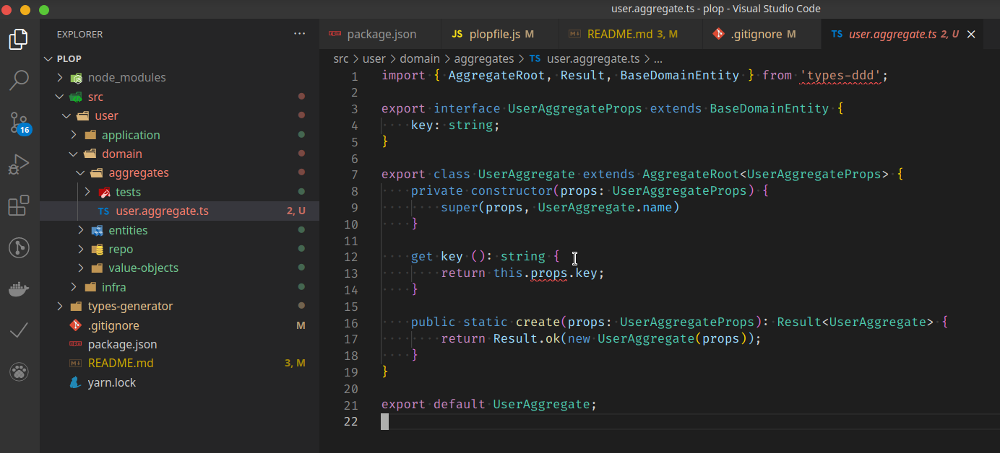

# Types-ddd Generator

## This lib generate types-ddd module and files

Download the `types-generator` folder. Put it on you project root folder.

Execute the command on your terminal on your project root.

```shell

wget https://github.com/4lessandrodev/types-generator/archive/refs/heads/main.zip && 
unzip main.zip && mv ./types-generator-main/types-generator ./types-generator && rm -rf main.zip types-generator-main

```

You may download clicking [HERE](https://downgit.github.io/#/home?url=https:%2F%2Fgithub.com%2F4lessandrodev%2Ftypes-generator%2Ftree%2Fmain%2Ftypes-generator) or clone this repo.

### Folder structure

```shell
  $ tree
  .
  ├── package.json
  ├── README.md
  └── src
       ├── config
       │    ├── main.ts    
       │    └── env.ts 
       │
       └── modules
            │ 
            └── [module-name]
                  │ 
                  │── domain
                  │     ├── value-objects
                  │     ├── entities
                  │     ├── aggregates
                  │     ├── events
                  │     ├── subscriptions
                  │     ├── repo
                  │     └── services
                  │ 
                  ├── application
                  │     └── use-cases 
                  │ 
                  └── infra
                        ├── models     
                        ├── repo
                        └── mappers 

```

Put the command below on you `package.json` scripts

```json

"scripts":{
    "generate": "yarn plop --plopfile ./types-generator/plopfile.js"
}

```

### Install plop and types-ddd

* `$ yarn add types-ddd` or `$ npm install types-ddd`
* `$ yarn add plop -D` or `$ npm install plop --dev`

> To generate a ddd module or resource use the command 

* `$ yarn generate <resource-name>` or 
* `$ npm run generate <resource-name>`

Example:

`$ yarn generate user`


> If you choose module. All default files and folders for a modules will be generated on src folder.




> By default import paths are set to aliases.

You can set alias on you `tsconfig.json` or change your templates import paths

```json
    "baseUrl": "src",
    "paths": {
      "@modules/*":["modules/*"]
    },
```

On your package.json 

```json
  "_moduleAliases": {
    "@modules": "./dist/modules",
  }
```

Install module alias 

`$ yarn add module-alias` or `$ npm install module-alias`

and finally, register it on your main file, before start your server.

main.ts / app.ts or index.ts

`import 'module-alias/register';`

You can use the repository as example 

[Click To Example](https://github.com/4lessandrodev/simple-ddd-app-example)
